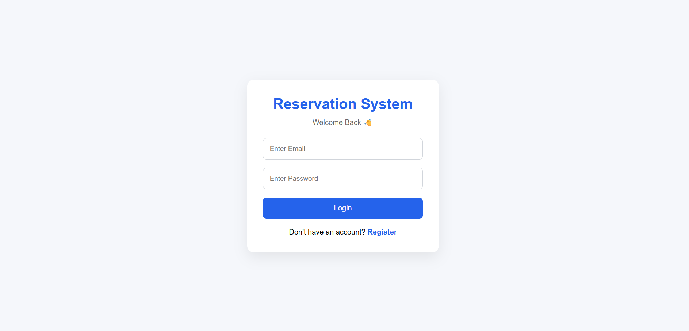
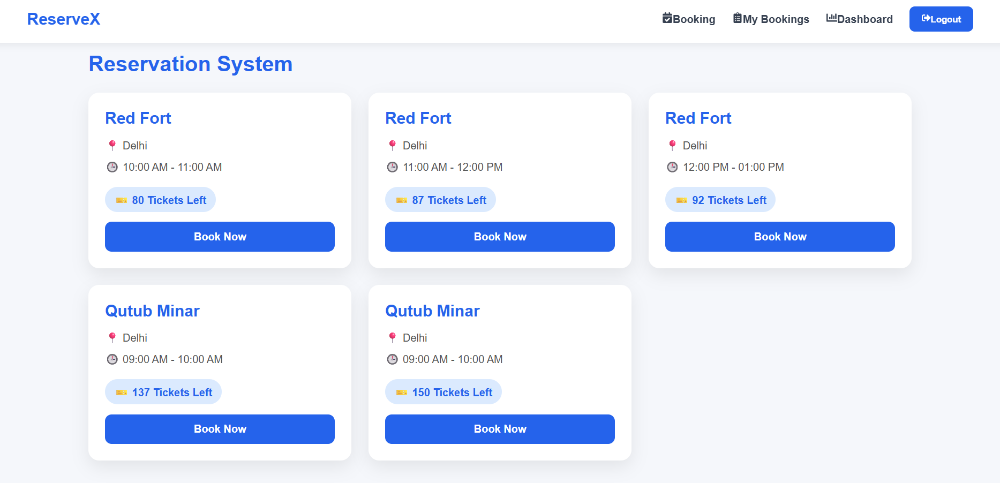
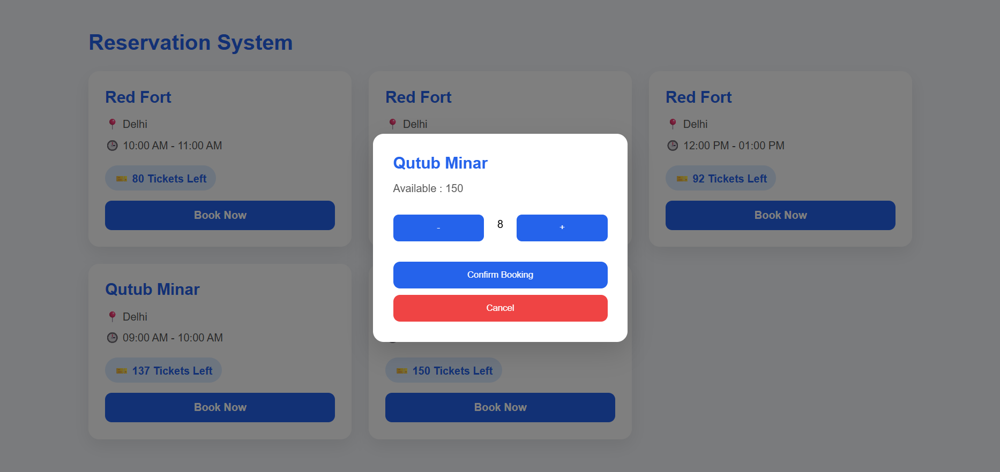
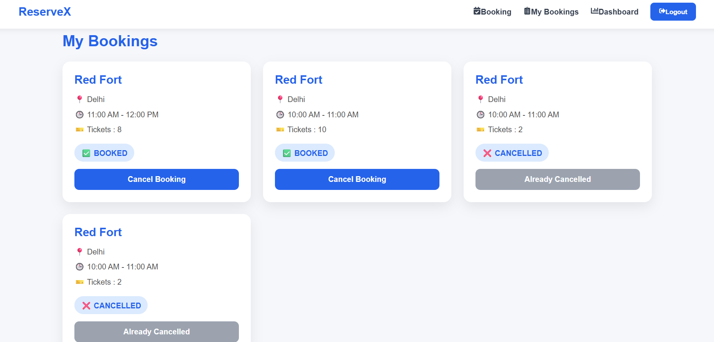
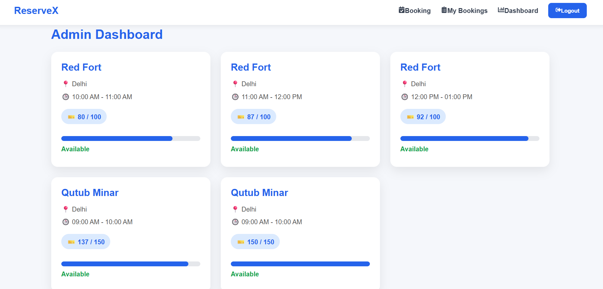

# 🚀 Reservation System (MERN Stack)

A full-stack Reservation System built with the MERN Stack that allows users to book and cancel reservations in real-time. The application uses JWT Authentication, MongoDB Transactions, Socket.io for live capacity updates, and role-based access control.


## 🌐 Live Demo

**Frontend:**  
https://reservation-system-6xm6.vercel.app/

**Backend API:**  
https://reservation-system-production-31b0.up.railway.app/

**GitHub Repository:**  
https://github.com/Devraj2Singh/reservation-system

## ✨ Features

### 👤 User

- Register & Login with JWT Authentication
- View available reservation slots
- Book tickets
- Cancel reservations
- View booking history
- Protected Routes

### 👨‍💼 Admin

- View all slot capacities
- Live dashboard updates using Socket.io
- Role-based access

### ⚡ Real-Time

- Live seat availability updates
- Instant dashboard synchronization
- MongoDB Transactions for safe concurrent booking

---

## 🛠 Tech Stack

### Frontend

- React.js
- React Router DOM
- Axios
- Socket.io Client
- React Hot Toast
- React Icons
- CSS3

### Backend

- Node.js
- Express.js
- MongoDB
- Mongoose
- JWT
- bcrypt
- Socket.io
- Express Async Handler

---

## 📂 Project Structure

```
reservation-system/

│

├── client/
│   ├── components/
│   ├── context/
│   ├── layouts/
│   ├── pages/
│   ├── services/
│   ├── socket/
│   ├── styles/
│   └── App.jsx
│
├── server/
│   ├── config/
│   ├── controllers/
│   ├── middleware/
│   ├── models/
│   ├── routes/
│   ├── services/
│   ├── socket/
│   └── server.js
│
└── README.md
```

---

## 🔐 Authentication

- JWT Authentication
- Protected Routes
- Admin Route
- Role-Based Authorization

---

## 📡 API Endpoints

### Authentication

```
POST /api/auth/register

POST /api/auth/login
```

### Booking

```
POST /api/bookings

DELETE /api/bookings/:id

GET /api/bookings/my-bookings

GET /api/bookings/capacity
```

### Sites

```
GET /api/sites

POST /api/sites
```

### Time Slots

```
GET /api/slots

POST /api/slots
```

---

## 🚀 Installation

### Clone Repository

```bash
git clone https://github.com/Devraj2Singh/reservation-system.git
```

### Backend

```bash
cd server

npm install

npm run dev
```

### Frontend

```bash
cd client

npm install

npm run dev
```

---

## 🌍 Environment Variables

Create a `.env` file inside the **server** folder.

```env
PORT=5000

MONGO_URI=your_mongodb_connection_string

JWT_SECRET=your_secret_key
```

---

---

# 🐳 Docker

This project includes Docker support for running both the frontend and backend using Docker Compose.

## Build and Start Containers

```bash
docker compose up --build
```

## Stop Containers

```bash
docker compose down
```

After the containers start successfully:

- Frontend → http://localhost:5173
- Backend API → http://localhost:5000

> **Note:** The application connects to MongoDB Atlas using the environment variables defined in the `server/.env` file.

# 📷 Screenshots

## 🔐 Login Page



---

## 📅 Booking Page



---

## 🎟️ Booking Modal



---

## 📖 My Bookings



---

## 📊 Admin Dashboard



---

## 🚀 Future Improvements

- Email Notifications
- Payment Gateway
- QR Code Tickets
- Booking History Filters
- Dark Mode
- Unit & Integration Testing

---

## 👨‍💻 Author

**Devraj Singh**

GitHub:
https://github.com/Devraj2Singh

---

## ⭐ If you like this project

Please give this repository a ⭐ on GitHub.
